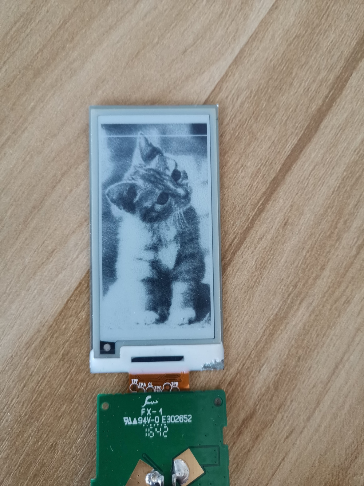

# EPD gray demo

汉朔2.13寸电子价签ESP32灰度显示示例程序。

## 基本原理

初始化清屏后调整并设置新的LUT，并使用特定的刷新方式（先更新较黑的像素点，后更新较白的像素点）进行刷新。

在整个刷新过程中，像素颜色越深，那么它被刷新的次数越多，像素颜色越浅，那么它被刷新的次数越少，最终使像素呈现不同的灰度。

## 图片选取

此示例程序使用`xpm`格式图片作为数据输入源，因为`xpm`格式为全ASCII字符格式，在代码中处理起来比较简单。

由于程序处理较为简陋，因此此示例程序使用的`xpm`图片需要满足如下条件，可以参考`main`目录下的图片提取色卡颜色。

* 16级灰度，并且没有alpha
* xpm文件中的色卡必须按数值大小从小到大进行排序
* 图片尺寸必须为122x250，和墨水屏分辨率保持一致

以上操作均可以使用GIMP图像处理工具来完成

## 编译烧录

编译和烧录方法参考乐鑫官方文档，这里不再赘述。

## 显示效果

